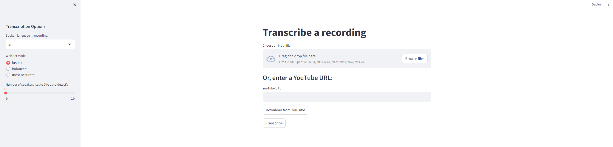

# Transcription
This is a Streamlit app that allows the user to transcribe videos and audios.

The user can also download videos from Youtube based on the URL and transcribe them. 

It is backed by [fast-whisper](https://github.com/SYSTRAN/faster-whisper).

## Demo



## Installation

```
poetry install .
```

You will need to add `LD_LIBRARY_PATH` variable into your environment:
```
export LD_LIBRARY_PATH=`python3 -c 'import os; import nvidia.cublas.lib; import nvidia.cudnn.lib; print(os.path.dirname(nvidia.cublas.lib.__file__) + ":" + os.path.dirname(nvidia.cudnn.lib.__file__))'`
```


